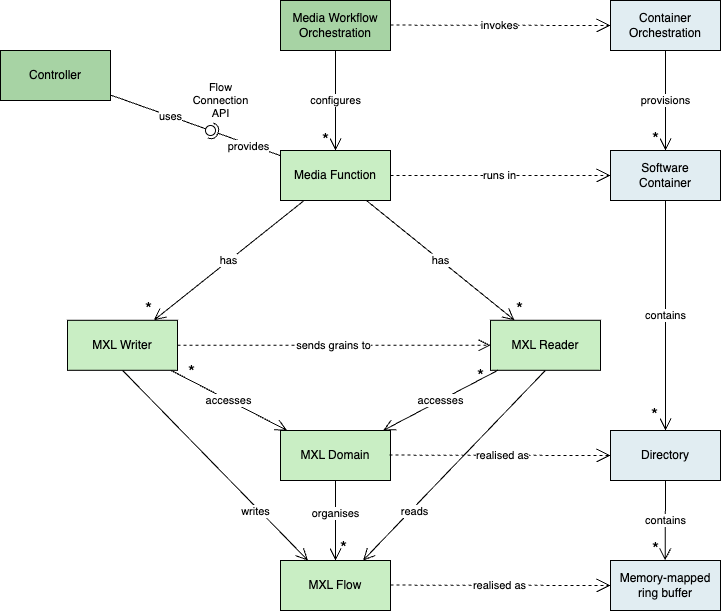

# API Requirements – Control of the Media Exchange Layer (MXL) v1.0

## 1. Purpose

This document defines the functional and non-functional requirements for a control API that manages `MXLReader`s and `MXLWriter`s in a DMF environment.

The API enables a control system to:

- Set parameters in `MXLReader`s and `MXLWriter`s.
- Query their current status.

This document is intended for implementers of control protocols that provide this API.

The following diagram shows how the control API interacts with the MXL components:

---

## 2. Scope

### 2.1 In Scope

- Control of MXL Readers
- Control of MXL Writers
- Querying current parameter values:
  - `MXLDomainID`
  - `MXLFlowID`

### 2.2 Out of Scope

- Mapping of Domain ID to Flow Path
  - This mapping must be configured when deploying the media function and is not handled by this API.
- Media transport, encoding, or payload-level processing
- Control of processing parameters

---

## 3. Definitions

| Term          | Description                                               |
| ------------- | --------------------------------------------------------- |
| `MXLReader`   | Component that consumes media from an `MXLFlow`.          |
| `MXLWriter`   | Component that produces media into an `MXLFlow`.          |
| `MXLFlowID`   | UUID of a media flow as defined in the MXL SDK.           |
| `MXLDomainID` | UUID of the domain in the same format as the `MXLFlowID`. |

---

## 4. Architecture Assumptions

- `MXLReader`s and `MXLWriter`s are part of Media Functions deployed by an orchestration system.
  - Deployment is outside the scope of this document.
- `MXLDomain`s and `MXLDomainID`s are created outside the scope of this document.
- Media Functions can resolve `MXLDomainID`s to `MXLDomain`s (paths) and vice versa.
- An `MXLReader` or `MXLWriter` can have access to one or more domains.
- An `MXLReader` or `MXLWriter` has a mechanism for discovering the `MXLDomain`s mapped into its filesystem.
- If a writer is started without a configured `FlowID`, it will create one.

---

## 5. Functional Requirements

### 5.1 MXLReader Requirements

#### 5.1.1 Set and Get `MXLFlowID`

- The API shall allow setting, updating, and retrieving the `MXLFlowID` of an `MXLReader`.

#### 5.1.2 Set and Get `MXLDomainID`

- The API shall allow setting, updating, and retrieving the `MXLDomainID` of an `MXLReader`.
- Invalid or inaccessible `MXLDomainID`s shall result in a validation error.

#### 5.1.3 Start `MXLReader`

- The API shall provide a method to start the read operation of an `MXLReader`.
- Starting an already running `MXLReader` shall be idempotent.

#### 5.1.4 Stop `MXLReader`

- The API shall provide a method to stop the read operation of an `MXLReader`.
- Stopping an already stopped `MXLReader` shall be idempotent.

#### 5.1.5 Get Accessible `MXLDomain`s

- The API shall allow retrieving a list of all `MXLDomainID`s from which the `MXLReader` can read flows.

### 5.2 MXLWriter Requirements

#### 5.2.1 Set and Get `MXLFlowID`

- The API shall allow setting, updating, and retrieving the `MXLFlowID` of an `MXLWriter`.

#### 5.2.2 Set and Get `MXLDomainID`

- The API shall allow setting, updating, and retrieving the `MXLDomainID` of an `MXLWriter`.

#### 5.2.3 Start `MXLWriter`

- The API shall provide a method to start the write operation of an `MXLWriter`.
- Starting an already running `MXLWriter` shall be idempotent.

#### 5.2.4 Stop `MXLWriter`

- The API shall provide a method to stop the write operation of an `MXLWriter`.
- Stopping an already stopped `MXLWriter` shall be idempotent.

#### 5.2.5 Get Accessible `MXLDomain`s

- The API shall allow retrieving a list of all `MXLDomainID`s to which the `MXLWriter` can write.

---

## 6. API Behavior and Constraints

### 6.1 Creation of `FlowID`

- The `FlowID` of a writer is not created by the control system.
- It is created either by:
  - The orchestration system, or
  - The writer itself.

### 6.2 State Management

- Readers shall expose their current operational state:
  - `started`
  - `stopped`
- Writers shall expose their current operational state:
  - `started`
  - `stopped`
- Readers and writers shall expose their current transport parameters, including:
  - `MXLFlowID`
  - `MXLDomainID`

### 6.3 Error Handling

All API errors shall return a structured error response containing:

- Error code
- Human-readable message
- Optional remediation hint

### 6.4 Idempotency

- Start and stop operations shall be idempotent.

---

## 7. Non-Functional Requirements

### 7.1 Reliability

- The API shall guarantee consistent state reporting.
- Partial updates shall not leave readers or writers in undefined states.

### 7.2 Performance

- Control operations (start, stop, configure) should be responsive and complete in a timely manner.

### 7.3 Security

- It is assumed that any API implementing these requirements will operate in an environment with security measures appropriate to the associated risks.

### 7.4 Observability

- Operational monitoring requirements will be defined in a future revision of this document.
